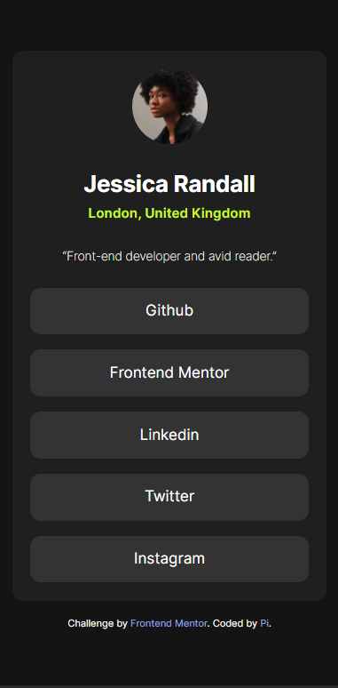

# Frontend Mentor - Social links profile solution

This is a solution to the [Social links profile challenge on Frontend Mentor](https://www.frontendmentor.io/challenges/social-links-profile-UG32l9m6dQ). Frontend Mentor challenges help you improve your coding skills by building realistic projects. 

## Table of contents

- [Overview](#overview)
  - [The challenge](#the-challenge)
  - [Screenshot](#screenshot)
  - [Links](#links)
- [My process](#my-process)
  - [Built with](#built-with)
  - [What I learned](#what-i-learned)
  - [Continued development](#continued-development)
  - [Useful resources](#useful-resources)
- [Author](#author)
- [Acknowledgments](#acknowledgments)

**Note: Delete this note and update the table of contents based on what sections you keep.**

## Overview

### The challenge

Users should be able to:

- See hover and focus states for all interactive elements on the page

### Screenshot

### Links

- Solution URL: [Add solution URL here](https://www.frontendmentor.io/solutions/restarting-at-frontend-with-social-links-profile-media-ggeYwicZ5c)
- Live Site URL: [Add live site URL here](https://social-links-profile-media.vercel.app/)

## My process

### Built with

- Semantic HTML5 markup
- CSS custom properties
- Flexbox
- CSS Grid

### What I learned

I have been a long time away from coding and as a restart I'm using this project to warm things up. Throught this project I've been able to relearn flex and grid properties, though I've barely used grid just to center things up.

### Continued development

I want to learn a lot more about developing accessible websites and increase my skills on responsive designs. 

I feel that I need a better understanding on how sizes and some flex and grid properties works and I also need to improve my naming and semantic html notion, which I'll work hard this year.

## Author

- Frontend Mentor - [@LeonCelestino](https://www.frontendmentor.io/profile/LeonCelestino)

## Acknowledgments

I want to acknowledge Grace and every other member of the frontend mentor community, you all have been helping me great so far.